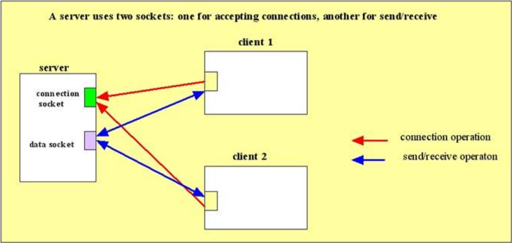
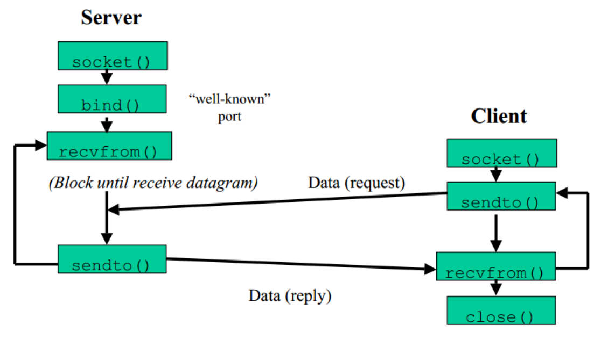

# 24/03/2026

## Socket TCP

Un socket è un oggetto `software` che permette l'invio e la ricezione di dati, tra host remoti (tramite una rete) o tra processi locali.

Di solito i server usano 1 socket per client (+ quello per accettare) (?)

1. Creazione dei Socket:
    Client e server creano i loro rispettivi socket, e il server lo pone in ascolto su una porta. Dato che il server può creare più connessioni con client diversi (ma anche con lo stesso), ha bisogno di una coda per gestire le varie richieste.

2. Richiesta di connessione:
    Il client effettua una richiesta di connessione verso il server. Il server riceve la richiesta e, nel caso in cui sia accettata, viene creata una nuova connessione.

3. Comunicazione:
    Ora client e server comunicano attraverso un canale virtuale, tra il socket del primo, ed uno nuovo del server, creato appositamente per il flusso dei dati di questa connessione: `data socket`.

4. Chiusura della connessione
    Essendo il TCP un protocollo orientato alla connessione, quando non si ha più la necessità di comunicare, il client lo comunica al server, che ne deistanzia il data socket. La connessione viene così chiusa.

### Famiglie di socket

I tipi di [protocolli] utilizzati dal socket, ne definiscono la famiglia (o dominio).
Possiamo distinguere, ad esempio, due importanti famiglie:
* AF_INET: comunicazione tra host remoti, tramite Internet;
* AF_UNIX: comunicazione tra processi locali, su macchine Unix. Questa famiglia è anche chiamata Unix Domain Socket.

###### Esercizio 1: Programmazione di un Socket - Web Server

qualche nota:
* il loopback e' l'ip locale (127.0.0.1)
* Su WireShark puoi selezionare l'interfaccia loopback. Cosi' puoi guardare il socket del client (e puoi confermarlo dall'output

###### Esercizio 2: UDP
Ce ne freghiamo della precisione dei pacchetti, vogliamo solo che arrivino velocemente.

Il Server non sta nemmeno ad ascoltare. E' subito in una situazione di receive.

Quindi anche il codice stesso del server e' piu' snello (fa molte meno cose).
Non fa nemmeno la chiusura della connessione.
Non controlla neanche che arrivino i pacchetti, li mandi e basta
Anche su wireshark vedi che si mandano moooolti meno pacchetti (solo 2 se lanci client e server nella cartella ./codice/udp)

