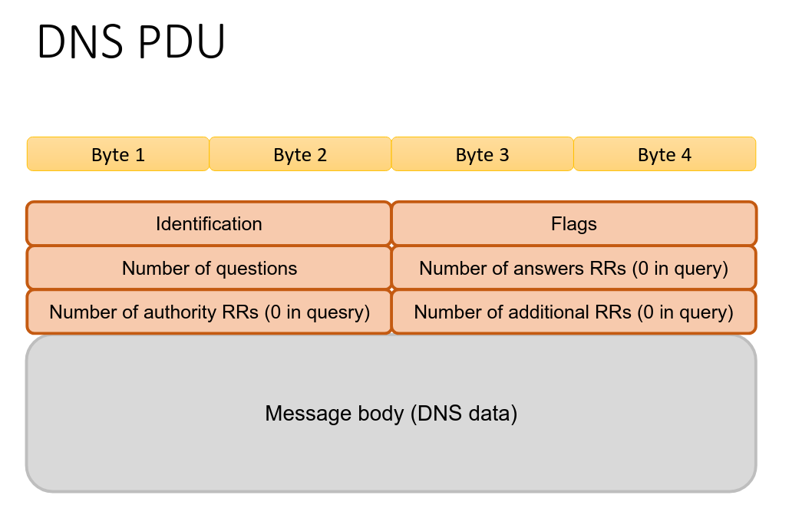

# DNS

Il dns e' l'applicazione, aggiunge delle PCI al pacchetto

# 06/03/2026

Il PCI che aggiunge sono: 
16 bit di identification, 16 di flags,
16 per number of questions, 16 per number of answers
        ^
        |
quanti nomi ho chiesto al dns

e altri 32 bit sempre legati alle risposte e richieste.

Puoi controllare anche su wireshark!!
<!-- soppa ragazzi ha detto (esclamazione) -->
I flags sono diversi: ad esempio il primo bit dice se e' answer o richiesta.
Su wireshark te li fa vedere tutti per bene ed e' molto carino.
(anche se degli altri flag chissene)

Adesso quindi abbiamo imparato come fa il client a mettersi in contatto con un server (attraverso i nomi).
Ora incominciamo a parlare di tutti i protocolli 

Nuova cartella

