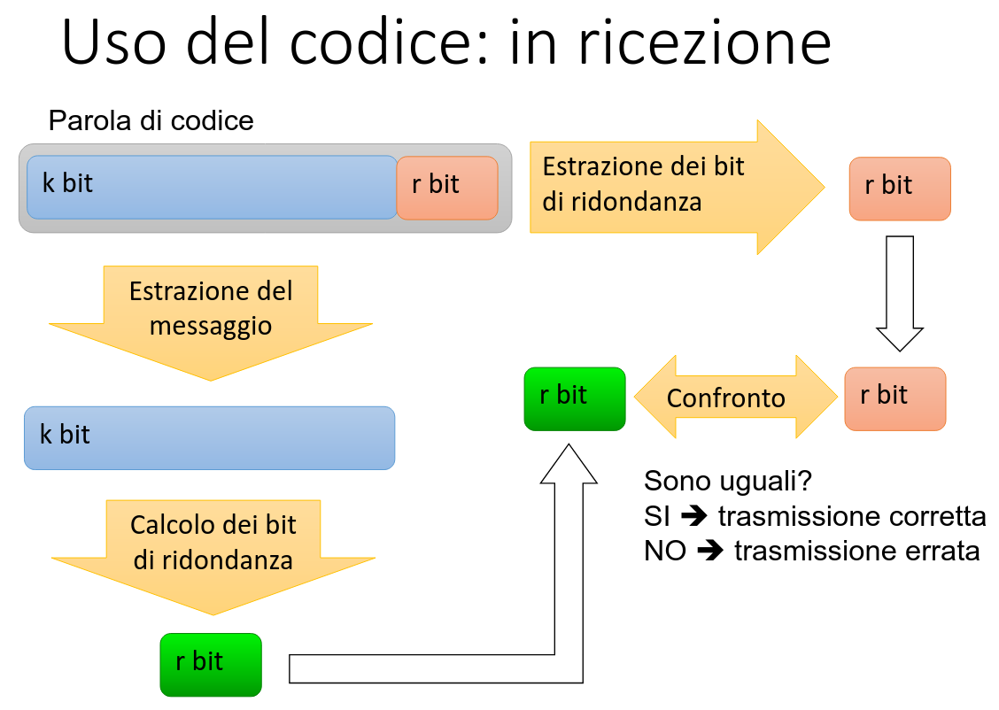
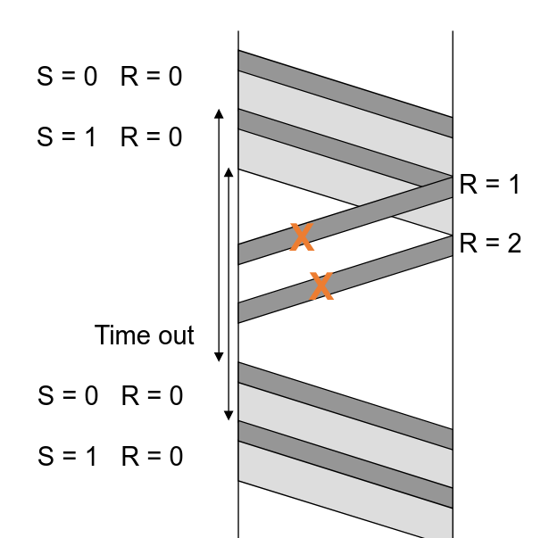
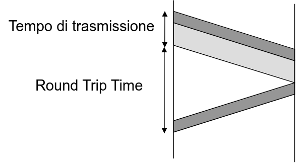

In una rete e' molto comune che i pacchetti arrivino in ordine abbastanza sparso.
Non e' detto che se parti prima arrivi prima (dipende che strada fai sulla rete)

Come si fa a garantire 
# Errori di trasmissione

* Codifica di canale con codici a rivelazione di errore
* Conferma di ricezione e ritrasmissione

Devo capire come capire se i bit sono sbagliati. Lo faccio attraverso una [codifica di canale].

Ad esempio potrei inventarmi una codifica per cui ogni bit della codifica di sorgente lo mando 2 volte.
Quindi se voglio mandare 1001 mando 11000011 in questo modo e ricevo dei bit sballati lo trovo subito.
Ovviamente se vengono sballati entrambi non ci posso fare nulla ma e' poco probabile.
<!-- spiderman ha calpestato il banco proprio difronte a callegati INCREDIBILE era proprio li' di fronte ma e' come se callegati abbia fatto finta di niente. -->
<!-- ha usato l'espressione "conti della serva" -->
Esistono codici solo per capire se ci sono errori e altri per correggerli invece (che capiscono anche se ci sono)

## codici di rivelazione o correzione errore

Voglio che i dati arrivino tutti giusti.

### rivelazione
In un pacchetto di 1000 bit ne basta anche 1 solo per capire se e' sbagliato.
Facciamo che se trovo un bit sbagliato mi faccio rimandare il pacchetto sbagliato.
La rilevazione costa: 1bit
La correzione costa: 1000bit (rimando tutto il pacchetto)

### correzione
Faccio che assieme ai 1000bit del pacchetto ne aggiungo 10 (che bastano) per correggere gli altri
Se c'e' un pacchetto sbagliato quindi lo posso correggere.
La rilevazione costa: 10bit
La correzione costa: 10

Se e' molto probabile fare errori allora conviene la correzione.
Altrimenti la rivelazione.

# 12/03/2026

## Codici a blocco

Blocco = k bit
Codice (di rilevazione errore) = r bit
n = k + r  <-- sarebbe il pacchetto lungo n (PCI + SDU)
Tutti questi numeri sono prestabiliti cosi' che chi riceve sa come risuddividere il messaggio

## Codici sistematici

Nella sequenza di n bit da trasmettere i k bit di informazione, mantenuti distinti dagli r bit di ridondanza, vengono trasmessi inalterati

Partiamo dal presupposto che i k sono tanti rispetto agli r.
Quindi se r e k differiscono do' la colpa ai k bit (probabilmente l'errore e' avvenuto li') e mi faccio ristrasferire tutto (anche se in teoria potrebbero essere giusti ma sbagliato r).

## che codifica usare?

### Bit di Parita'

Conta i bit a 1. Metti r (1bit) a 0 o 1 in modo da fare venire il totale degli 1 un numero pari.
In pratica questo si fa con mettendo a XOR tutti i bit k.
Quindi e' velocissimo!

Ma e' funziona?
Si solo se sbagli un numero dispari di bit.
Quindi lo puoi usare solo se k e' abbastanza piccolo (ad esempio nella prima versione ascii l'ottavo bit e' usato per la correzione.

### Checksum

Quello che si usa oggi.
Si puo' calcolare per un numero qualsiasi di blocchi (multiplo di 16, se non lo e' si fa un po' di padding).
Si dividono i bit in blocchi da 16.
Si fa la somma complemento a 1 di tutti i blocchi.
Quando ho un bit carry lo sommo come bit meno significativo.
Poi metto questo numero nel PCI.

In ricezione basta fare la somma di tutti i blocchi come prima sommando anche il numero checksum del PCI.
Se il risultato viene con tutti i bit a 1 il messaggio e' giusto!!!!

Funziona benissimo per rilevare gli errori, il suo difetto e' che devi usare 16 bit (che non sono pochissimi).
Quindi se hai pacchetti formati da poche parole (blocchi) non e' molto consigliato usare il checksum.

Funziona sia bigEndian che littleEndian (ovviamente) (si puo' usare anche su architetture diverse).
<!-- sesso degli angeli counter +1 -->
### Codici polinomiali

[A / B = Q + r]

Fisso B (protocollo fissato).
Trasmetto A solo multipli di B.
Se A arriva sbagliato non e' piu' divisibile per B (da resto) e allora me ne accorgo.

La cosa bella e' che in binario fare somme e' uguale a fare sottrazioni.
Questo e' il principio, vediamo come funziona:

* Trasformo sequenze di bit in polinomi
    10010 = x^4 * 1 + x^3 * 0 + x^2 * 0 + x * 1 + 1 * 0 = P(x)
* Divisione tra polinomi:
    [P(x) / G(x) = Q(x) + r(x)]  <-- G(x) e' concordato (protocollo) (e' detto polinomio generatore)
    Ricorda la divisione in colonna (si fa con le sottrazioni => in binario e' velocissimo)
    Bisogna scegliere furbescamente G(x) in modo da (?) . 
    G(x) e' dello stesso grado di P(x) => nel mondo binario viene fuori sempre un polinomio di grado minore:
    ( x^4 + x^3 + 1 ) * x^2 = x^6 + x^5 + x^2
       1 1 0 0 1               1 1 0 0 1 _**0 0**_        <-- Ho aggiunto due 0 (moltiplicando per x^2)

    Sia r il grado del polinomio G(x). r(x) ha sicuramente grado < di r (la sottrazione si fa con lo XOR).

    Voglio trasmettere Pk-1(x):
    * moltiplico: Tn-1(x) = Pk-1(x) * x^r

    * divido: Tn-1(x) / Gr(x) = Pk-1(x) * x^r = Q(x) + R(x)

    * mi interessa solo il resto: di sicuro R(x) ha grado minore di r (grado di G e quello di x^r)
        ( Tn-1(x) - R(x) ) / Gr(x) = Q(x)
        se R(x) = 0 allora non ci sono errori

    Nella cpu questo si puo' ottimizzare un sacco e fa tutto in un ciclo di clock.

#### Esempio

G(x) = x^2 + x + 1      <-- quindi r = 2
P(x) = x11+0+x9+x8+0+x6+0+0+0+x2+0+1    <-- da trasmettere

devo moltiplicare per r:

P(x)x2= x13+0+x11+x10+0+x8+0+0+0+x4+0+x2+0+0

divido: 
T(x) / G(x)   da cui ottengo:

R(x) = 1
Q(x) = x11 + x10 + x9 + x8 + x2 + x + 1

quindi il polinomio da trasmettere è
P(x)x2 + R(x) = Tn-1(x) = x13+0+x11+x10+0+x8+0+0+0+x4+0+x2+0+1

In conclusione la sequenza di bit da trasmettere è dunque: 101101000101[01] <-- bit del controllo errore

Se quando arriva, divido per G(x) e ottengo resto 0 allora e' giusto.

La domanda e': sono sicuro che se il resto viene zero sia giusto? (magari e' sbagliato lo stesso ma non lo ho rilevato).

Mando:  1011 0100 0101 01       = T(x)
arriva: 1[1]11 0100 0[0]01 01       = T'(x)

E' come se l'errore fosse avvenuto sommando (XOR) 0[1]00 0000 0[1]00 00 = E(x)

Se divido:
T'(x) / G(x) = ( T(x) + E(x) ) / G(x) = (T(x) / G(x)) + (E(x) / G(x))

Quindi non rilevo l'errore se E(x) / G(x) fa 0!!!!
Quindi vorrei scegliere G in modo da minimizzare le probabilita' che E(x) / G(x) non faccia 0.

Ora pausa non so se torno dopo (laurea riki)

# 19/03/2026

L'utlima volta non sono tornato (ho perso un ora).
Pero' non sembra andato molto avanti: siamo a slide Numerazione

## Inizio nuova trasmissione

A contatta per la prima volta B.

### Numerazione

Entrambi tengono dei contatori (`numerazione`) che contano quanti pacchetti sono stati mandati.
I contatori stessi vengono messi dentro al pacchetto per identificarlo.
Grazie a questo identificatore B puo' anche confermare ad a i pacchetti che gli sono arrivati.

Si pone un vincolo sul numero di pacchetti mandati in una volta.

### Time Out

le linee scure sono le info dei protocolli. Sono PCI (protocol control information)
Quelle chiare sono i dati utili.
Quindi B manda anche solo pacchetti con PCI senza dati ulteriori (ACK).

Cosi' se non arrivano piu' i messaggi di conferma invece di deadlock si puo' riprendere.

### ACK

Sono i pacchetti di conferma (`acknowledge`).
La domanda e': se B ha anche dei dati da mandare li puo' mettere insieme al pacchetto ACK?
La risposta e' si', si chiama `piggybacking`.
Attacchi le conferme a un pacchetto normale.

Un ack e' semplicemente il numero R che ti dice quanti pacchetti ti sono arrivati.

Domanda: se ti arriva un R=4 ma non ti arrivano prima R=0,1,2,3 cosa vuol dire? 0,1,2,3 sono arrivati o no?
Bisogna decidere se mandare un ACK ogni volta che ti arriva un messaggio (`conferma esplicita`) oppure mandarne uno ogni tanto (`conferma implicita`) per confermare la ricevuta di piu' pacchetti.
Tieni a mente che anche un ACK seppur piccolo occupa spazio e banda del canale.

Ovviamente non si puo' confermare la conferma (loop infinito inutile).

### Finestra di trasmissione

S e' il contatore che conta i pacchetti che ho trasmesso (e poi lo metto nelle PCI).
Il problema e' che, essendo un protocollo, devo stabilire a priori il numero di bit per rappresentare S.
Se arrivo al punto che vado in overflow come faccio?

Allora, quando a B arriva il pacchetto 3, lo processa e da l'ACK ad A, il pacchetto 3 e' andato.
Dopo un po' di tempo arriva un altro pacchetto numerato 3, non c'e' problema. Il vecchio 3 e' gia' andato tanto.
Il problema si pone quando arrivano due pacchetti 3 molto vicini tra loro.

Allora si fa che si stabilische una finestra di pacchetti che si possono trasmettere senza conferma.
Cioe' ad esempio scelgo W=4 (window) e quindi mando al massimo 4 pacchetti insieme non confermati.
Quando B ti manda 1 ACK allora mandi 1 pacchetto (cosi' i pacchetti inviati non confermati sono comunque 4).
Se scelgo Smax piu' grande W (la finestra) allora risolvo il problema di prima.

Se nella conferma esplicita (mando sempre ACK) non ti arriva ACK1 ma non di 0 la window rimane bloccata nello 0. Quando arriva l'ACK di 0 si sbloccano 2 in un colpo solo.
Per questo motivo i protocolli moderni fanno un ibrido tra conferma esplicita e implicita: mandano sempre l'ack per ogni messaggio ma se ti arriva un ACK di 3 (e non ti sono ancora arrivati quelli prima) puoi contare che quelli prima sono gia' arrivati (cosi' non si blocca la window). FICO

Ora bisognerebbe capire come si sceglie $$S_{max}$$ e $$W$$
> [!WARNING]
>
> $$W$$ deve essere MINORE di $$S_{max}$$
>
>  se fosse uguale ci sarebbero dei casi molto sfortunati che pero'
>  romperebbero tutto (guarda slide 55)
>
=>
### Controllo di flusso

Come funziona quando A e' velocissimo a mandare pacchetti ma B e' molto lento a processarli?
All'inizio A manda tanti pacchetti (tanti quanto la dimensione della finestra). [*]
B pero' ci mette un po'. A rimarra' quasi sempre bloccato nella finestra.
La cosa bella pero' e' che grazie a questa cosa della finestra dopo il primo burst di pacchetti quelli dopo vanno alla velocita' di quanto B riesce a consumarli (quindi si sincronizzano in automatico).

[*] B deve essere in grado di memorizzare tutta la dimensione della finestra.
    Ecco come si decide la dimensione della finestra (ogni volta e' decisa a seconda delle capacita' del ricevitore)

## Protocollo ARQ

Ora ho codice rilevazione (capire che sono giusti);
ho identificatori;
ho timeout;
ho ack;
ho finestra di trasmissione;

Manca il fatto della `ritrasmissione`!

### Go-back-n ARQ

Se mi arriva sbagliato il pacchetto 5 (ma mi arrivano giusti 6 e 7), vengono rimandati 5, 6 e 7 (la finestra (?))

### Selective Repeat ARQ

Ti arriva il pacchetto 1 ma 0 no. Allora mando un pacchetto indietro Selective Reject 0 (rimanda il pacchetto 0)

Slide 59 e' sbagliata, dovrebbe esserci RJ2, non RJ3
Vabbe' comunque ti serve a far capire che il timeout deve essere ben dimensionato.

## RTT

Round Trip Time = tempo necessario per effettuare un’andata e ritorno sul canale.

### Scelta timeout

Il time out va relazionato al RTT

* Time out troppo breve:
    * Non si attende l’arrivo dell’ACK
    * Invio non necessario di trame duplicate

* Time out troppo lungo:
    * Inutile attesa prima di ritrasmettere le trame errate

In entrambi i casi si spreca capacità di trasmissione (banda) e si degradano le prestazioni.

Prossimamente proviamo a studiare le prestazioni in base ai parametri (che sono un fottio):
dimensione pacchetti, dimensione W, Smax, ...
