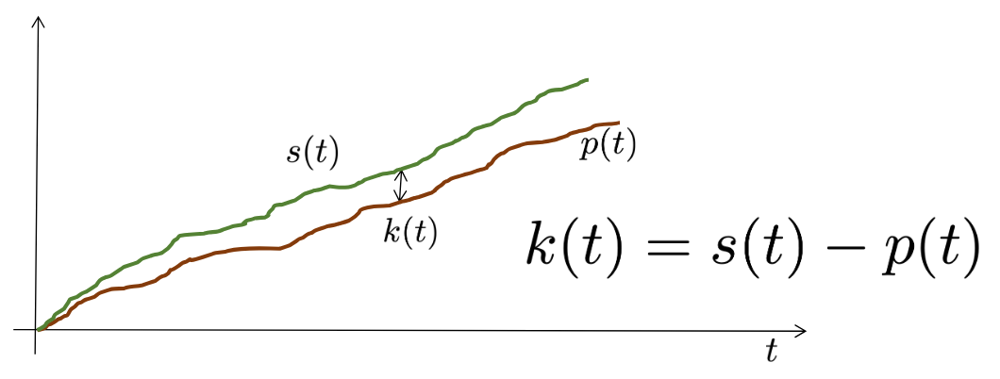
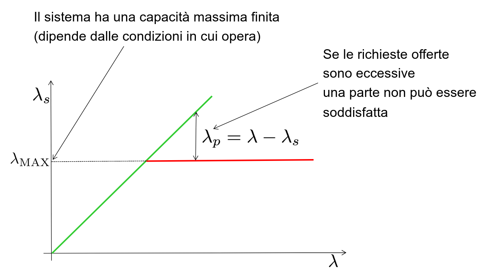
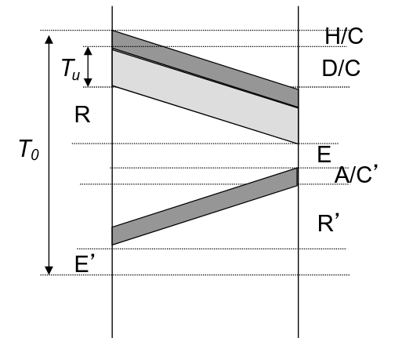

# Parliamo un po' di numeri e prestazioni

Quando mandi pacchetti ci sono 3 funzioni:

s(t) = numero di pacchetti mandati nel tempo
p(t) = numero di pacchetti "risposti" nel tempo
k(t) = differenza tra p e s

 

Supponiamo che i pacchetti abbiano size costante D (bit).
Supponiamo che il canale abbiam velocita' cosstante C (bit/s).
Il tempo `minimo` impiegato per trasmettere un pacchetto (PDU) e' $$\theta = D/C$$
Minimo perché D quantifica i dati di utente, mancano eventuali PCI e possibili tempi morti dovuti alle dinamiche dei protocolli (conferma ecc.)

Supponiamo 
- C = 10 Mbit/s
- D = 10 Kbit/s
- $$\theta$$ = D/C = 1 ms

* Se $$\lambda < 1000 PDU/sec$$
    Posso sperare di riuscire a trasmettere tutte le trame che arrivano (non è detto che ci riesca vedremo perché fra poco)
* Se $$\lambda > 1000 PDU/sec$$
    Di sicuro arrivano più PDU di quelle che il canale può materialmente trasmettere
Quindi dev'essere
$$\lambda \theta < 1$$cioe' $$\lambda < \lambda_{max} = 1/\theta$$

## Traffico offerto

Il prodotto $$\lambda \theta$$ si chiama traffico offerto.
È una quantificazione del «lavoro» che l’utente vorrebbe fosse fatto dal servitore
Non è detto che questo sia possibile per la ragione che abbiamo visto prima

Il traffico offerto ci dice quante nuove richieste arrivano durante il tempo necessario a servire una richiesta
È abbastanza ovvio che per non saturare il sistema questo numero debba essere inferiore a 1

Posso usare anche $$D$$ invece di $$\theta$$:
$$\lambda D$$ e' misurata in bit (non pacchetti) per secondo (bit rate)
<!-- incredibile esempio con damigiana e imbuto -->
Inoltre C (quanti dati mando al secondo) non e' proprio C. Infatti ci sono anche le PCI che devo togliere a C.
Quindi introduco $$C_e$$ (C senza le PCI, quindi e' minore) che ti dice quanto e' `efficiente il protocollo`
$$\eta = \frac{C_e}{C} \le 1$$

## Prestazioni Stop and Wait

D: dimensione campo dati in bit
• H: dimensione dell’header (PCI) in bit,
• F=D+H: lunghezza totale del frame,
• A: lunghezza dell'ACK,
• E, E’: tempi di elaborazione per il controllo del frame in arrivo e per la preparazione del frame in partenza
• R: tempo di propagazione del segnale da un capo all'altro del collegamento,
• I = E+R; I’= E’+R’
• C, C’: velocità dei canali di trasmissione (in generale andata != ritorno)

### Efficienza

Tempo intercorso fra l’invio di due frame successivi $$T_0 = F/C + I + A/C' + I$$
Il tempo strettamente necessario per la trasmissione dei dati di utente è $$T_d = D/C$$

$$\eta = T_d / T_0 = D / (C T_0) = D / (D+H+IC+I'C+AC / C' ) $$

Per semplicita' poniamo I = I' e C = C' e A ~= H ==> $$\eta = D/(D+O)$$

Mi manca l'overhead.

## Caso con errore

Devo tenere conto della probabilita' che si verifichi un errore.
$$E[k] = P_F/(1-P_F)$$  e' il numero medio di errori consecutivi
$P_F$ = probabilita' di errore per PDU
$K$ = numero di trasmissioni

Sta parlando di probabilita' ma usciamo 15 minuti prima.

